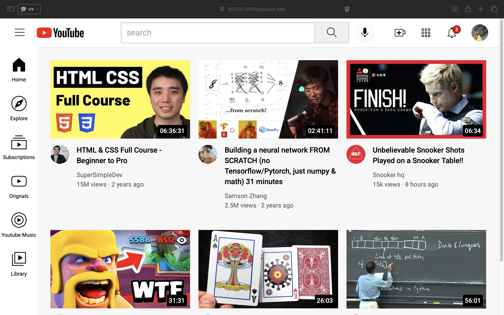

# YouTube Clone

A responsive YouTube interface clone built with HTML and CSS.



## Features

-  Responsive video grid layout
-  Functional search interface
-  Sidebar navigation
-  Notifications with badge count
-  Mobile-friendly design

## Technologies Used

- HTML5
- CSS3 (Flexbox, Grid)
- Responsive Design (Media Queries)

## Folder Structure

youtube-clone/
├── index.html (rename your youtube.html to index.html)
├── styles/
│   ├── general.css
│   ├── header.css
│   ├── sidebar.css
│   └── video.css
├── icons/ (all your SVG icons)
├── thumbnails/ (all thumbnail images)
└── channel-pictures/ (all profile pictures)


## How to Run

1. Clone the repository:
```bash
git clone https://github.com/your-username/youtube-clone.git
cd ...
open index.html
